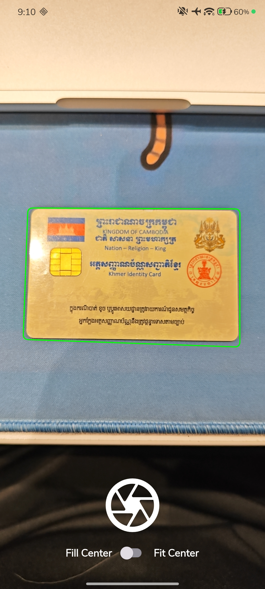
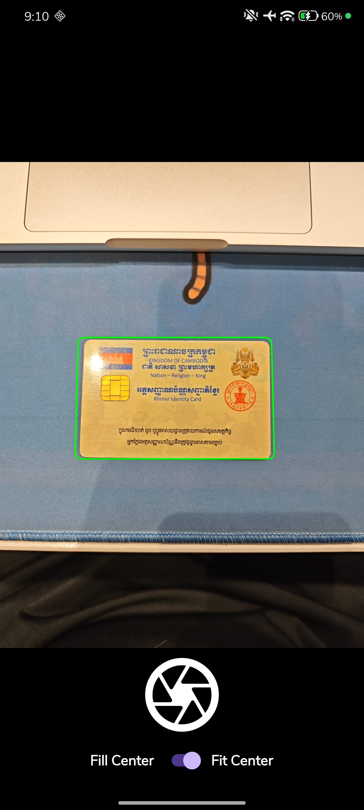
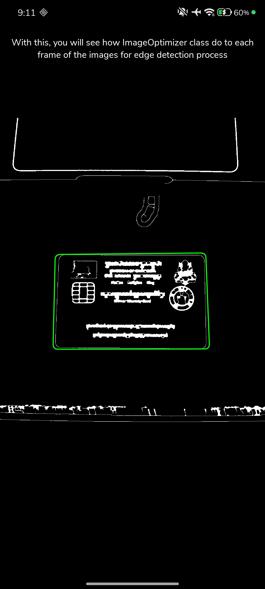

# Android with OpenCV

OpenCV (Open Source Computer Vision Library) is a widely used open-source, cross-platform library
for real-time computer vision, image processing, and machine learning. It features over 500
algorithms, supports C++, Python, Java, and MATLAB, and runs on Windows, Linux, Android, and macOS,
making it essential for tasks like facial recognition, object detection, and robotics.

Key Features and Capabilities:

- **Image/Video Processing**: Supports image smoothing, filtering, color space conversion, and
  geometric transformations.
- **Computer Vision Algorithms**: Includes feature detection (Harris corner, Shi-Tomasi), object
  detection (Haar cascades), and tracking.
- **Deep Learning Module (dnn)**: Enables loading and running pre-trained models from frameworks
  like TensorFlow, PyTorch, and Caffe.
- **Performance**: Optimized for real-time applications using CUDA and OpenCL.

Sources:

- Website: https://opencv.org/
- GitHub: https://github.com/opencv/opencv
- Maven Repository: https://mvnrepository.com/artifact/org.opencv/opencv

# Project Screenshots

A visual showcase demonstrating OpenCV features in action. From real-time image processing to
document detection and edge filtering, these visuals highlight how computer vision integrates
seamlessly into the mobile experience.

    
